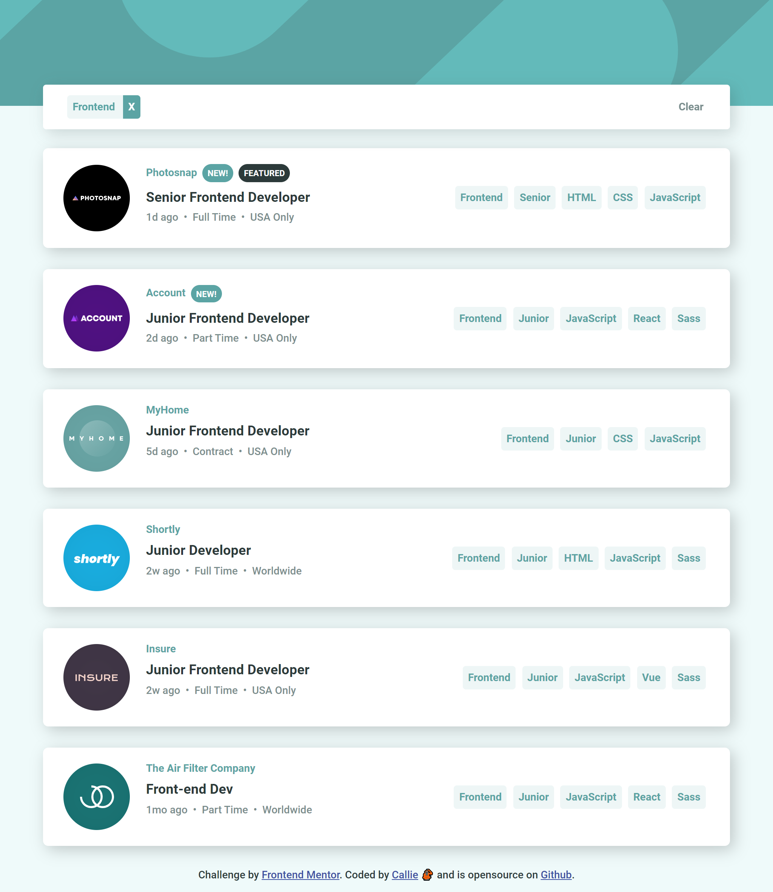

# Frontend Mentor - Job listings with filtering solution

This is a solution to the [Job listings with filtering challenge on Frontend Mentor](https://www.frontendmentor.io/challenges/job-listings-with-filtering-ivstIPCt).

## Table of contents

- [Overview](#overview)
  - [The challenge](#the-challenge)
  - [Screenshot](#screenshot)
  - [Links](#links)
- [My process](#my-process)
  - [Time spent](#time-spent)
  - [Built with](#built-with)
  - [What I learned](#what-i-learned)
  - [Continued development](#continued-development)
  - [Useful resources](#useful-resources)

## Overview 👀

### The challenge 💪

Users should be able to:

- View the optimal layout for the site depending on their device's screen size
- See hover states for all interactive elements on the page
- Filter job listings based on the categories

### Screenshot 📸

### Links 🔗

- Solution URL: [https://github.com/Callietron300/static-job-listings-master](https://github.com/Callietron300/static-job-listings-master)
- Live Site URL: [https://courageous-dolphin-5accb0.netlify.app/](https://courageous-dolphin-5accb0.netlify.app/)

## My process 🎨

### Time spent ⏳

CSS : 1-2hours
JS : 7+hours

### Built with 🏗

- HTML
- CSS
- JavaScript

### What I learned 🤓

- `.includes()` - a great function for checking lists of arrays in if statements
- `.remove()` - to remove an item from its own parent element
- Practice alot of looping for this project & more condiationals

### Continued development 🤔

- **Use chat GPT Less**- i used it alot to help me with creating my JS for making the filters appear in the filter box. Hopefully with more practice ill rely on it less.
- **Better function naming** - I used the word filter alot in my function naming and i think it should spend a bit more time being thoughtful about function names
- **Add event handlers to parents** - i learnt this later on and was too deep to make the changes for this project. I was using `.forEach()` to cycle through lists of elements.
- **Smaller functions** - my functions where too big

I want to try to learn more about the following:

- Arrow functions
- Simplifying conditional statements
- maps
- chaining methods
- Animations

### Useful resources 📚
